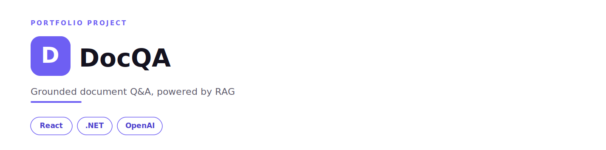
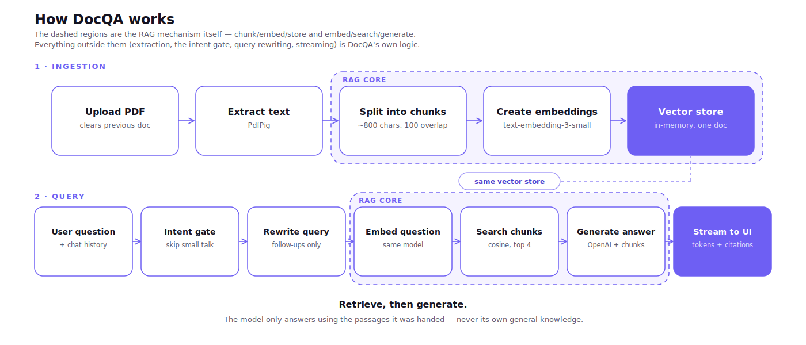

# DocQA

DocQA is a Retrieval-Augmented Generation (RAG) app that lets you upload a PDF and ask questions about it in a chat interface. Answers are generated only from text retrieved from the document, never from the model's general knowledge, and every response shows the exact source passages it used, with similarity scores. Built with a React frontend and a .NET backend, using OpenAI for both embeddings and generation, with streaming responses, multi-turn conversation memory, and history-aware query rewriting.

---

## Why RAG? 

A language model doesn’t know the contents of your private documents. If you ask it questions about a PDF it has never seen, it may generate incorrect or hallucinated answers. Retrieval-Augmented Generation (RAG) addresses this by retrieving the relevant parts of the document before generating a response, ensuring that answers are grounded in the document rather than the model’s general knowledge.

## How RAG works ? 

RAG works in two phases:

* Ingestion : The document is split into overlapping chunks. Each chunk is converted into an embedding (a vector representation of its semantic meaning) and stored in a vector database or in memory.
* Query : The user’s question is converted into an embedding and compared with the stored document embeddings to retrieve the most relevant chunks. These retrieved passages are then provided to the language model as context, with instructions to generate an answer using only the supplied information.

## How DocQA works ? 

The following diagram illustrates the complete DocQA workflow used in this project :

